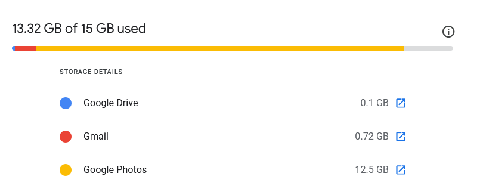

# google-photos-backup
Procedure and script to free up storage and backup Google Photos :camera: :video_camera: :smile_cat:

# Background
I keep running out of storage on my Google account and its all the fault of google photos! :worried:

I refuse to spend money on extended storage for every tumblr screenshot I've ever taken. I also don't want to lose the ability to send/receive emails. I also have a Windows computer that doesn't load HEIC photos. It's a terrible combination of circumstances and I'm sick of it.

Documenting for my own reference and as I carry out across different Google accounts. Hopefully this saves me or someone else some time.

# Overview
0. Delete any photos you don't want before all the processing.
1. Request Google Photos export through Google Takeout.
2. Download photos to desired location. <em>Optional: Select any videos or live photo MP4s worth saving and store in a separate directory.</em>
3. Convert HEIC photos to JPG, remove metadata and live photos if desired.
4. Check your work, then remove photos from Google Photos!

# How to run
You need to have ImageMagick installed: https://www.imagemagick.org/

Set `rootdir` to a root directory **<em>designated solely for newly exported Google Photos</em>**. This script will run recursively, converting the contents of all subdirectories. Run `python heictojpg.py`.

Global variables (False by default):
* `removeHEIC`: Rather than renaming to retreivable 'heic.old' extension files, set **True** to remove the original HEIC upon JPG conversion.
* `removeJson`: Google Takeout includes a metadata file for each file, set **True** to remove these!
* `removeMP4`: Live Photos are saved as a still photo HEIC and a 2-3 second MP4 video. Sometimes these only hold the audio, sometimes the visual is preserved. Set **True** to remove these!
  * **Warning**: This will delete any and all other audio files and potentially videos too! Do not set true if any other audio files or videos worth saving may be present.

# Notes on live photos and videos in mp4 format
In order to make video preservation more straightforward, I recommend adding all videos to their own folder (not the auto-generated one) in Google Photos before requesting an export through Google Takeout. This can also include live photos for which you want to preserve the "live" feature, as these will also save as videos.

When you download the export, store the Videos folder in a separate location than the rest (outside the designated root directory), so you can run the JPG conversion and remove mp4s by default for all other live photos without losing the files you want to keep.